# 【チャレンジローンチ】入門ガイドブック｜スワイプ

Brain公開ページから取得した**販売ページ／購入前プレビュー**のスワイプ。

| 項目 | 内容 |
|---|---|
| 元URL | https://brain-market.com/u/tanakayuichi/a/bzQzN0UjMgoTZsNWa0JXY |
| 著者 | 田中祐一 |
| 価格（取得時） | 特別価格 980円（〜2026-08-04）→ 以降 1,980円 |
| 公開日 | 2026-08-01 |
| レビュー特典 | １ステップ販売型ファネル素材集 |
| 取得範囲 | 購入前プレビュー（販売レター相当）。購入後の本文・特典ファイルは未取得 |

## ローカル確認

- HTML: `index.html`
- 画像: `images/`
- 原文HTML: `body.remote.html`

---

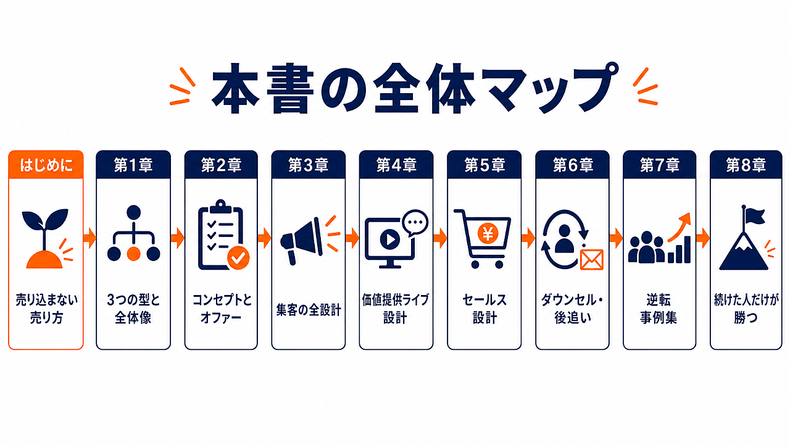

**※2026年8月1日〜4日は、特別価格にしています。**

**以降、1980円に値上げしますので、お早めに手に取ってください。**

**はじめに**

**著者紹介 —— 累計100億円越えの現場でたどり着いた「売り込まない」プロモーション**

> 

田中 祐一（たなか ゆういち）

1986年新潟県生まれ。芝浦工業大学卒業後、NTTデータを経て起業。プロダクトローンチの専門家として1,000名以上のクライアントを支援し、累計売上123億円以上を達成。主宰するPLCでは月商100万円超316名、月商1,000万円超60名を輩出。リピート率66.7%。（本項の実績数値はいずれも自社調べで、成果には個人差があります）

著書に『僕たちは、地味な起業で食っていく。』（SBクリエイティブ）、『WEB集客を考えたら必ず読む本』他、世界4カ国で出版。

**発信も頑張っているのに、なぜ売上につながらないのか。**

このコンテンツを読んでくださり、ありがとうございます。田中祐一と申します。オンラインで高単価な商品を売る仕組みが得意です。

活動歴13年の古参ローンチおじさんになります。70業種ものプロモーションをサポートし、今現在も30を超えるチームがまず売り上げをあげるための一歩として選択するマーケ手法をお届けできたらと。

今、このコンテンツを開いているあなたは、きっとこんなことを感じているんじゃないでしょうか。

「自分の商品やサービスには自信がある。でも、それをどうやって届ければいいのかわからない」

「Xやインスタも頑張ってきた。でも、肝心の売上につながらない」

「セールスが苦手で、クロージングのたびに胃が痛くなる」

その気持ちは、よくわかります。

だからこそ僕は、「売り込まなくても、自然に選ばれる」売り方を追い求めてきました。広告費に年間3億円使ってさまざまなファネルを検証してわかった答えが、この本で伝えるチャレンジローンチです。

**なぜ「チャレンジローンチ」が生まれたのか**

僕は長年、プロダクトローンチ --- 動画を数本見せて、欲しい気持ちが高まったところで販売する手法 --- の専門家として、クライアントの売上を支えてきました。

案件によってはスピリチュアルや、心理学という市場で一撃1億を超える販売もできたりしました。

ところが、あるときから明確に感じ始めたことがあります。

「これまでのやり方が、だんだん効きづらくなってきた」ということです。

いくつかの変化が絡み合っています。

まず、YouTubeをはじめ、質の高い情報が無料でどんどん見られる時代になりました。

そうすると、「メールアドレスを登録しないと動画が見られない」という、プロダクトローンチのファネルが持っていた優位性が、以前ほど効かなくなってきます。

動画そのものの視聴率も、じわじわと下がる傾向にあります。効かなくなったわけではありません。でも、以前と同じやり方では、少しずつ反応が取りづらくなってきている。

これは僕だけでなく、多くの発信者が直面していた変化でした。

「どうせ売られる」「演出でしょう」と予定調和的に感じられることも増えたこともあるのでしょう。市場全体が慣れていったんですよね。

そこで僕が着目したのが、「一方的に見せる」のではなく「その場で一緒に体験してもらう」--- ライブです。

ライブなら、参加者の反応がリアルタイムで見えるし、その場で修正もできる。

動画制作の重さもありません。

調べていくと、海外にヒントがありました。

「チャレンジ」という仕組みです。

ただ、海外のチャレンジには、そのままでは日本に持ち込みにくい特徴が2つありました。

ひとつは、有料で行われていたこと。海外って97ドルチャレンジみたいなのが多いんですよね。

もうひとつは、21日間など期間が長かったことです。

日本では、無料でメールアドレスや公式ラインを登録してもらう「無料オプトイン」で見込み客を集めるのが主流。そこに、長期・有料のプログラムは噛み合いません。

そこで僕は、「無料で参加でき、短期間で完結する」日本向けのバージョンへと、何度も改善を重ねました。

そうしてたどり着いたのが、3日間・5日間の「チャレンジローンチ」です。

実際にやってみると、結果は明確でした。

僕自身はもちろん、この手法を渡したクライアントたちも、次々と大きな成果を出していったのです。

**準備2週間、5日間のライブで500万円が売れた日**

まず、僕がこのチャレンジローンチを初めて自分で試したときの話をします。

やったことはシンプルです。準備に2週間。5日間のライブで価値を提供し、最終日に商品を案内する。それだけです。

複雑なセールスレターも、作り込んだ動画もありません。

それでも、ゴールから逆算して5日間の流れを設計する--- これだけは徹底しました。

結果、最終日に案内した17万9,800円の商品が次々と申し込まれ、5日間のライブで売上は500万円に。しかも一度も「買ってください」と無理にお願いしていません。

改善して臨んだ2回目は、同じ流れで1,500万円になりました。

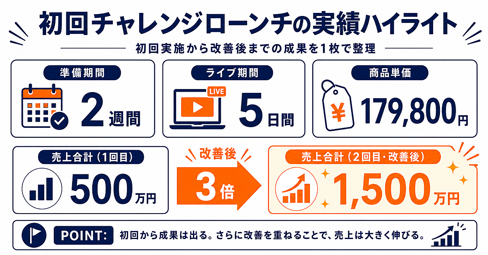

※ 本書に記載する売上・実績は、いずれも個人の成果であり、同様の成果を保証するものではありません。

**「田中さんだからでしょ？」というわけではありません**

よく言われます。でも、違います。

この方法をテンプレート化して、最初に31名のビジネス初心者に試してもらいました。

結果、31名中27名が30日間でチャレンジローンチを実施して売り上げをあげました。

初心者も含めて30日でやり切れたんですよ。

生まれた売上は合計で4,600万円を超え、中には1,000万円以上を売り上げた人もいます。

もちろん、積み上げてきたものが違うから差はあります。

これは「いける！」

その後、PLCという僕の講座を通じて、この手法を伝え続けてきました。

初回ローンチでの成功率は70%です（＝初めてのチャレンジローンチで、以前より売上を伸ばした、または初めての売上を作った人の割合）。

大事なのは、「オンラインビジネス初心者」も結果を出せたということ。

コーチ、コンサルタント、セラピスト、士業、デザイナー、主婦、会社員 --- ジャンルも経験も関係ありません。テンプレート通りに実践すれば、成果につながりやすい。それがチャレンジローンチの大きな強みです。

さて、私が関わらせていただき売り上げ報告をいただいたジャンルで言うと・・・

> 

セールスコンサル、鍼灸、ハンドメイド教室の集客、火災保険活用ノウハウ、パーソナルトレーニング、電子出版、ネイルスクール、リフォーム工事、潜在意識覚醒、ピアノ教室経営、英語コーチング、二重窓工事、カラーセラピー、介護事業、お片付け、風水、WEBデザイナー育成、幼児教育、ダイエット、アート教育、整体院経営、筆跡心理学、サロン集客、マイル活用、アーユルヴェーダ、保険営業、育脳、波動占い、翻訳事業、ヘッドスパ、FX投資、教室運営、脳科学メソッド、広告運用、カウンセラー起業、プロモ動画制作、デトックスサロン、PRマーケター育成、交渉術、パーソナルジム経営など…

などがあります。

むしろ、売りづらい商品ほど、わかりづらい商品ほど効果を感じていただけることもあります。

何個か、チャレンジローンチでの実例をあげます。

**畑瀬理惠子さん（鍼灸）—— 広告30万円で1,600万円**

畑瀬理惠子さんは、論文や書籍3冊の実績を持つ鍼灸師です。

以前はハウスリスト頼みで一人でキャンペーンを回し、最高600万円で頭打ちでした。

販売した商品は人気鍼灸師になる技術です。

リストとの関係性がなくなっている中で、広告費30万円でプロモーションを実施。

3日間チャレンジに330人が集まり、個別相談32人のうち29人が成約し、売上1,600万円に達しました。

チャレンジローンチで、価値を感じていただけたからこその高い成約率ですね。

**杉崎記子さん　健康ジャンルで5000万円**

杉崎記子さんは、もとは会社員を27年務め、スリランカ在住、ビジネス経験はまったくのゼロという状態からのスタートでした。

そこから1本目のチャレンジで180万円。広告を活用して1,600万円、さらに3,400万円と伸ばし、累計5,000万円を超えています。

販売商品はアユールヴェーダを使った健康法

海外在住で人に会うことがほぼない杉崎さんですが、チャレンジローンチを通してマニアックな知識が伝わり、「この先生にお願いしたい」となって売れていきました。

**川谷響さん（店舗×ローンチ）—— エバーグリーン化で年3,000万・商圏が広がった**

川谷響さんは、つくばでパーソナルジムを営みつつプロデュース業も手がけています。店舗を一人で回しているため、月100万円・年1,500万円が限界でした。

店舗経営者のための仕組み化講座を販売されています。

そこにチャレンジローンチを活用し、単月1000万円を達成。

さらにエバーグリーン化（常時回る仕組み化）でベースに積み上げ、年商3,000万円へ。ファン化が進み、片道2.5時間かけて毎週通う遠方客も現れ商圏が拡大しました。

さらいにはプロデュース業でもこのスキルを活用して売り上げを作れててます。

他にもこんな報告をいただいています。Facebookのキャプチャ切り抜きます。

５チャレ®️とは、僕がノウハウ化しているチャレンジローンチのフォーマットです。

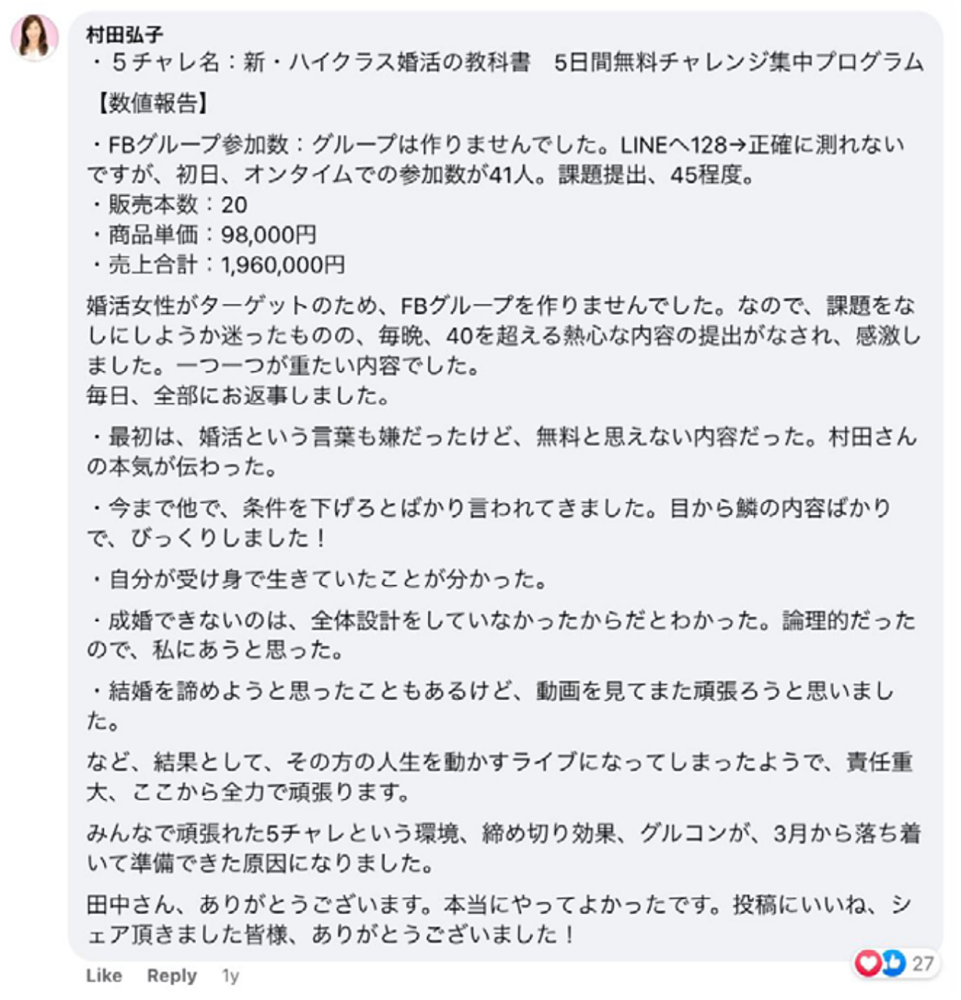

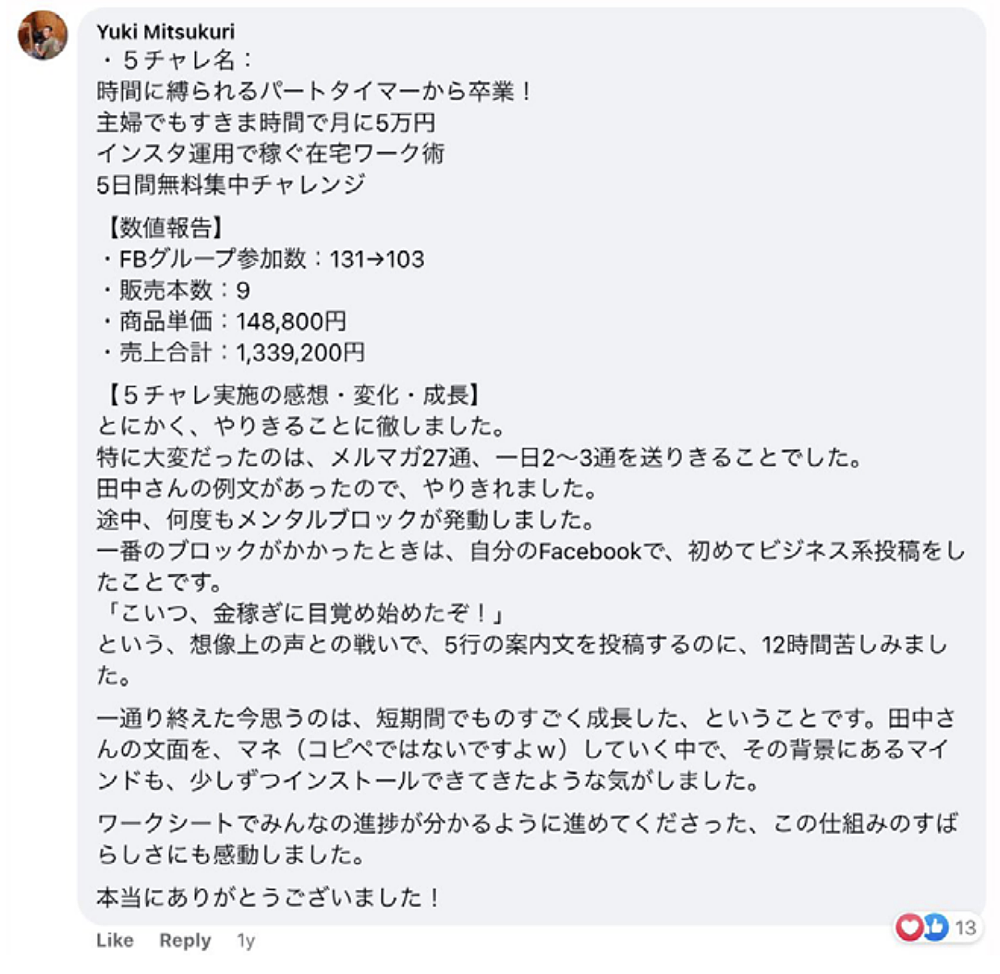

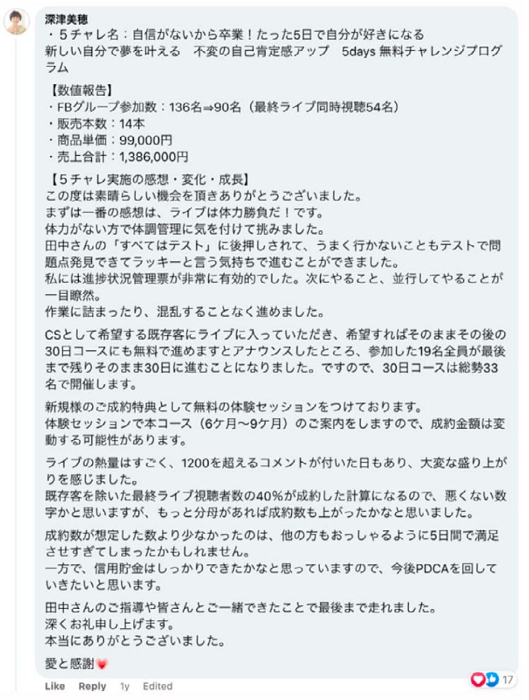

**なぜ「売り込まずに売れる」のか**

チャレンジローンチの何がすごいのか。

一言でいうと、「売り込まずに売れる」ということです。

3日間、あるいは5日間のライブで、参加者と一緒に学び、一緒に成長する。

その過程で信頼が生まれ、「この人からもっと学びたい」と自然に思ってもらえる。

だから、最終日に商品を紹介したとき、押し売りではなく「待ってました」という反応が返ってくるんです。

キーワードは「体験価値」です。

これが、複雑な動画やセールスレターがなくても売れる理由です。

**理由1：売り込み感が出にくい**

チャレンジローンチでは、全体の9割が「価値提供」です。3日間なら2日半、5日間なら4日半を、参加者への教育とサポートに充てます。

販売は最後の1割だけ。しかも、それまでの価値提供で「もっと学びたい」という気持ちが自然に育っているので、商品の案内が「売り込み」ではなく「次のステップの提案」として受け取られやすくなります。

僕のPLC受講生からも、「セールスが苦手な自分でも自然に売れた」という声が一番多いです。

**理由2：短期間で信頼が構築できる**

プロダクトローンチの動画は、見込み客にとって「いつでも見られるもの」です。だからこそ、後回しにされがちです。

一方、チャレンジローンチのライブは「今、この時間に参加する」というリアルタイムの体験。毎日コメントを交わし、課題を提出し、フィードバックをもらう。

この「一緒に過ごした時間」が、動画だけでは得にくい深い信頼を生みます。

いわゆる「体験価値」ですね。実際にアウトプットをしたりフィードバックするからこと信頼関係が高まっていきます。

**理由3：再現性が高い**

僕がチャレンジローンチをテンプレート化し、初めて31名に試してもらったとき、31名中27名が30日でチャレンジローンチを実施しました（実行率87%）。これは短期間でスパルタロードマップをやっていただいたので、高い実行率が出せました。

なぜこれほど再現性が高いのか。理由はシンプルで、「話す内容のテンプレート」「集客の導線」「販売の手順」が全て体系化されているからです。

あなたがやることは、テンプレートを自分の商品に合わせてカスタマイズするだけ。

**理由4：準備がとにかく軽い**

動画を撮る必要なし。凝ったランディングページも不要。メールも最小限。

準備するのは、集客ページ、教育コミュニティグループ、ライブのシナリオ。これだけです。動画ローンチのように2〜3ヶ月もかかりません。（初挑戦の準備期間の目安は、はじめにと付録Aを参照してください）

だからこそ、「完璧主義で行動できない」という人にこそ向いている手法なんです。ライブは完璧じゃなくていい。むしろ、等身大の姿が信頼につながる。

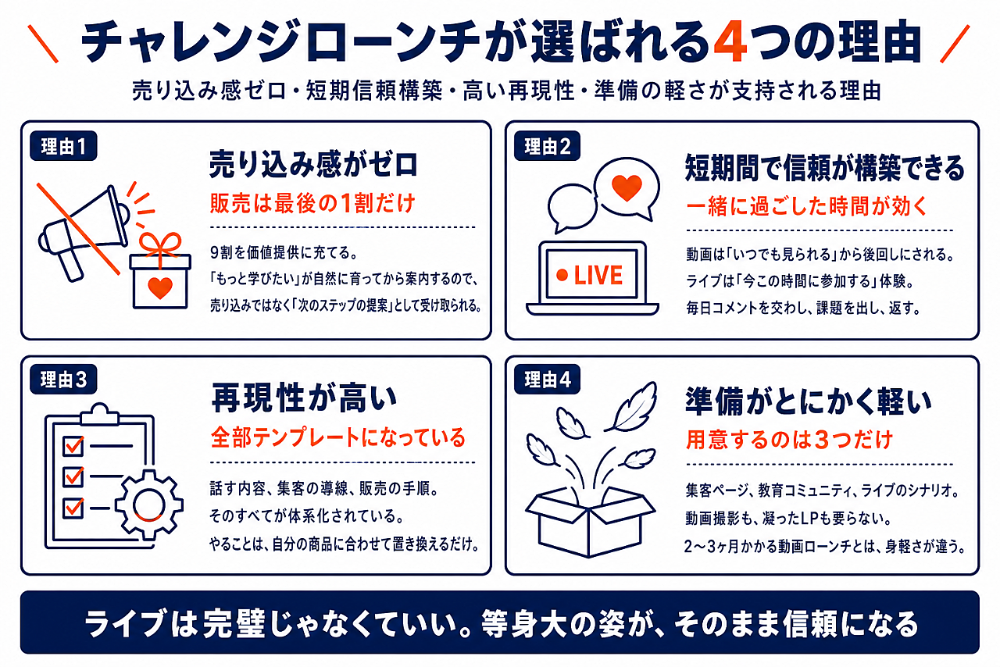

**あなたが作るのは、この「仕組み」です**

先に、チャレンジローンチの全体像を1枚でお見せします。販売商品の単価によっていろんなフォーマットがありますが、基本形がこちら。

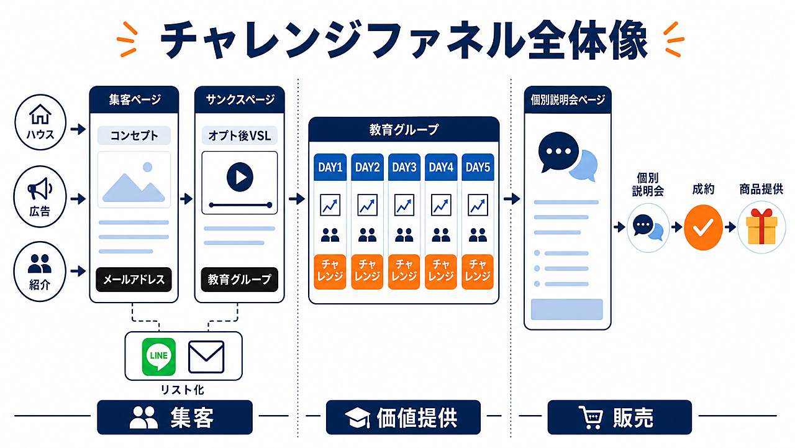

大きくは、集客 → 価値提供（ライブ）→ 販売の3つのフェーズでできています。

見込み客を集め、数日間のライブで一緒に学びながら信頼を築き、最終日に「次のステップ」として商品を案内する。骨組みは、たったこれだけです。

この本では、この仕組みの一つひとつを、今から全部、順番に解説していきます。

今はまだ全体像がぼんやりでも大丈夫です。読み終えるころには、この図の各ブロックを、自分の手で作れるようになっています。

> 

**POINT**

**通常のセールスは「説得して買ってもらう」。チャレンジローンチは「体験させて、欲しくなってもらう」。この違いが、複雑な仕組みなしで500万円という売上を生み出しました。**

**Brainで書かれている内容を公開します。**

本コンテンツは86306文字と60個を超える図解資料でわかりやすく、理解しやすいように作っています。各章で何が学べるのかまとめさせていただきますね。

**第1章**

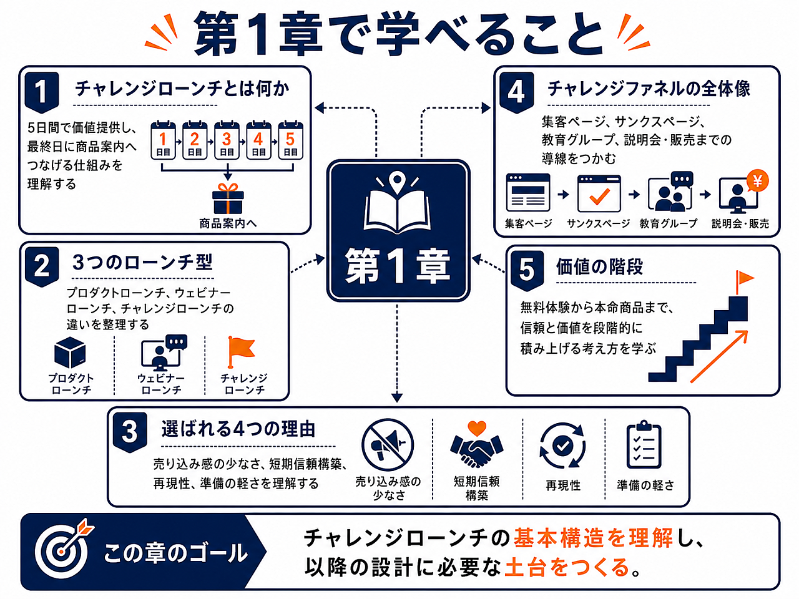

**第2章**

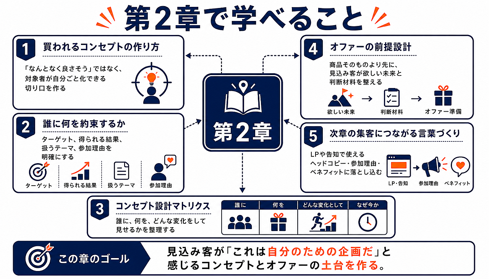

**第3章**

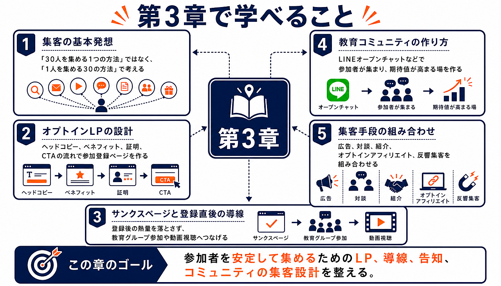

**第4章**

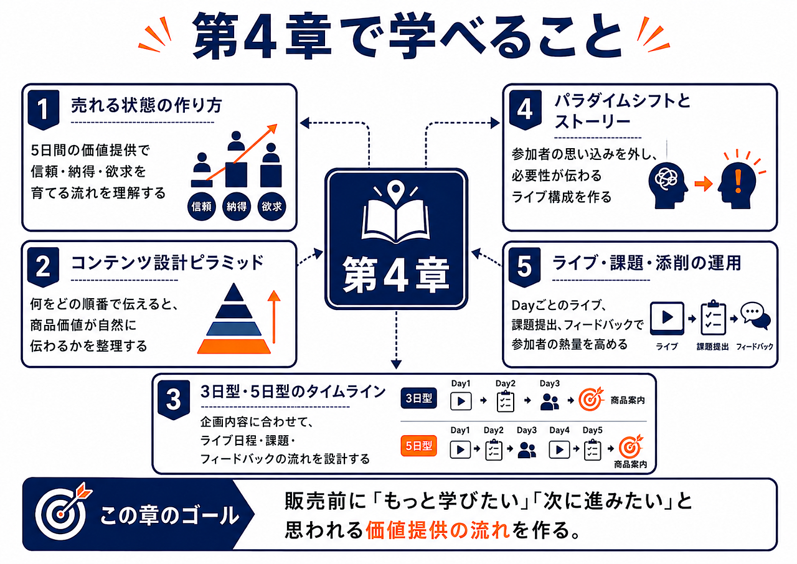

**第5章**

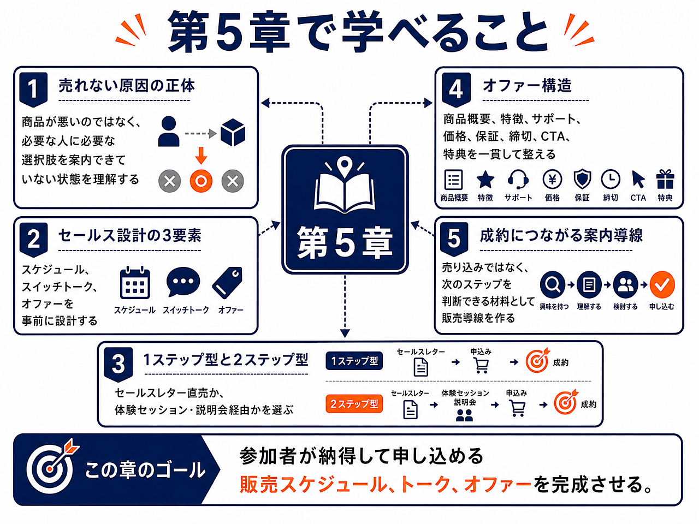

**第6章**

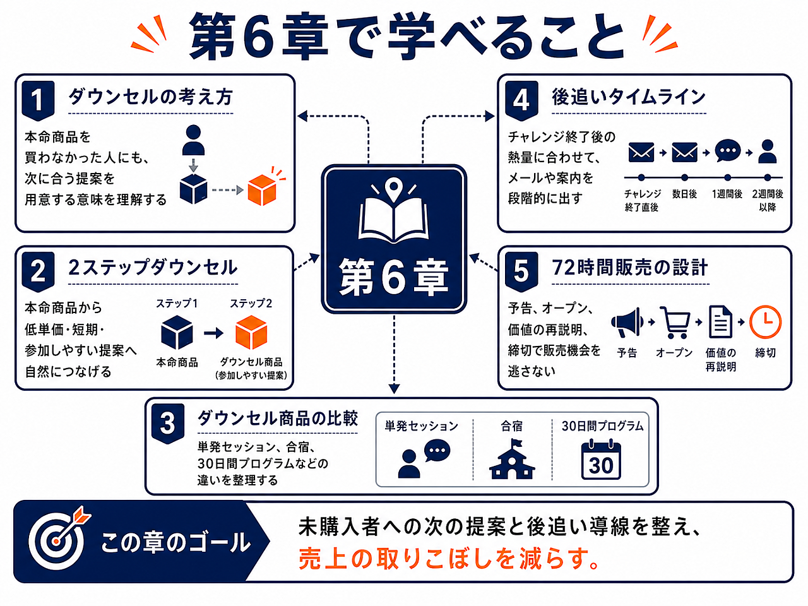

**第7章**

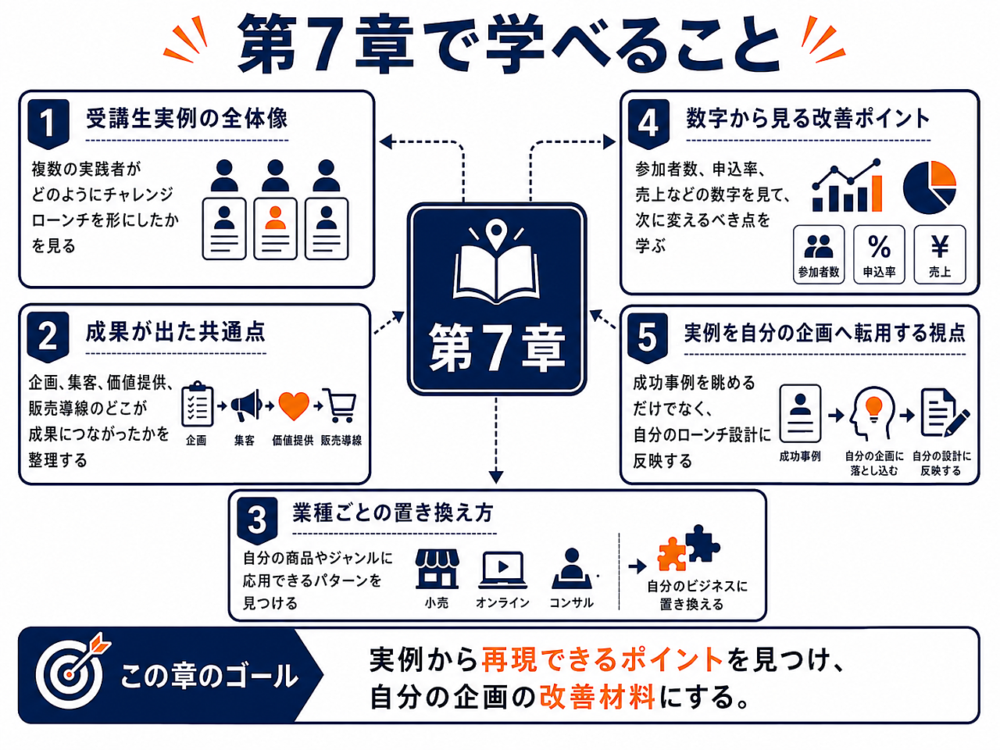

**第8章**

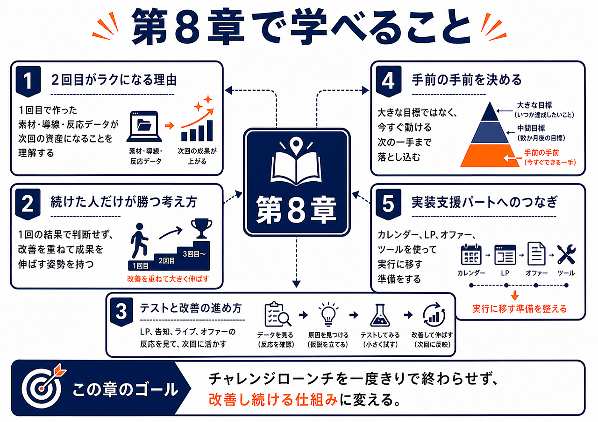

**付録**

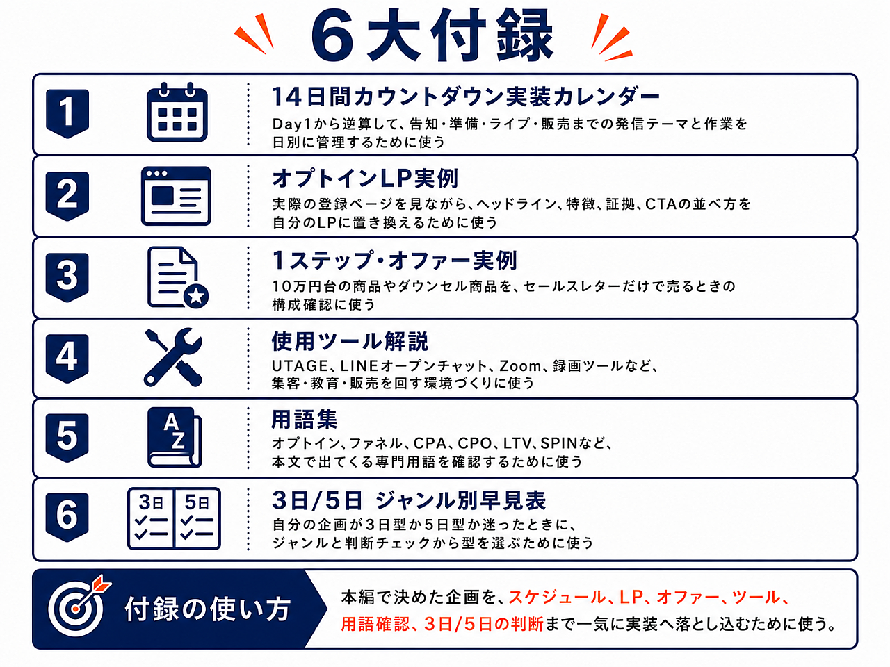

**このBrainの歩き方 —— どこから読めば、最短で自分のローンチが組めるか**

本書は、さきほどの全体像に沿って、第1章から順に進みます。あなたの現状に合わせた、おすすめの読み方を３パターンご紹介します。

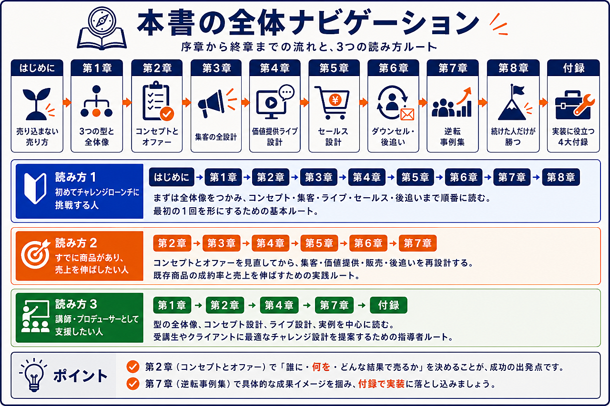

各章末にはチェックリストを、多くの章にはその章に対応した受講生の実例も置いています。進捗を書き込みながら読み進めてください。

購入者の方には特典も用意しています。

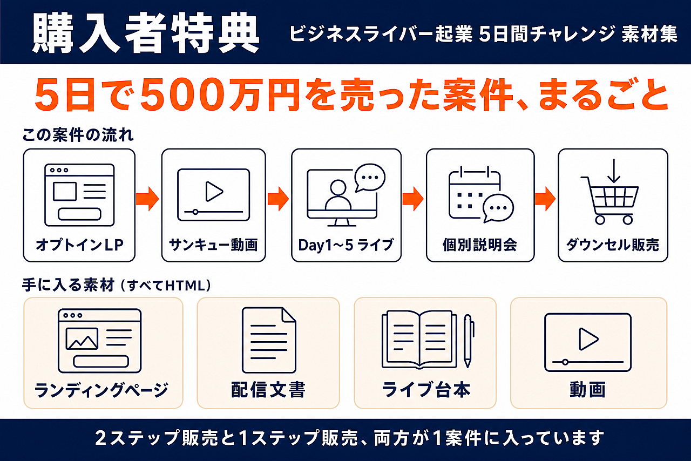

本編に何度も出てくる「5日間で500万円」の話。

あれは実際にあった1つの案件です。その案件の素材を、まるごとお渡しします。

集客に使ったオプトインLP。Day1からDay5までのライブ台本と、実際に話した動画。5日間で流した配信文。個別説明会の誘導ページ。そしてダウンセルの販売ページまで。

穴埋めテンプレートではありません。売れた完成品そのものです。

この案件がおもしろいのは、1つの中に売り方が2つ入っていることです。本命は個別説明会を挟んで売る2ステップ。買わなかった方には、説明会なしのダウンセルを1ステップで売っています。第5章と第6章で説明した2つの型が、同じ案件の中で両方動いているのを見られます。

付録Bで構造を解説しているオプトインLPも、この案件のものです。本編で骨格を見て、特典で完成品を見比べてください。

すべてHTMLで、アクセスできるようにしています。

そして、いちばん速い使い方はAIに読ませることです。売れた完成品がテキストで丸ごと手元にあるので、「これを自分の商品に置き換えて書き直して」と頼めば、たたき台がその場で出てきます。ゼロから書き始めるのと、売れた実物を下敷きにするのとでは、出てくるものの精度が変わります。

mdファイルにしていますので、是非ともAIエージェントに取り込んでください。

正直なところ、この使い方ができるだけで数万円ぶんの価値はあると思っています。

こちらは購入後のLINEオープンチャットにて受け取ってください。

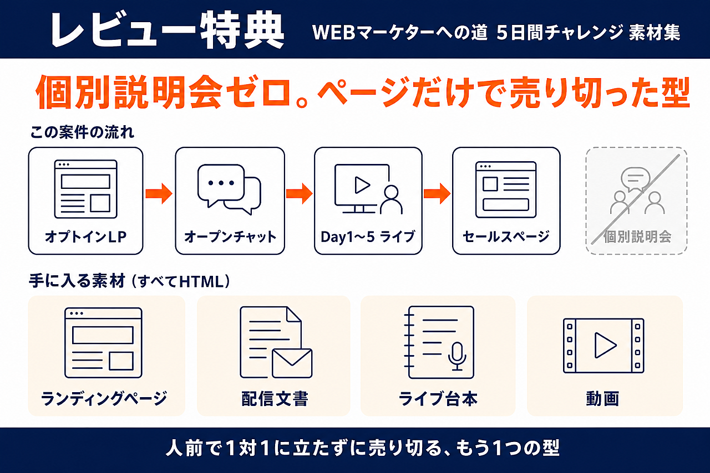

「個別相談は、正直やりたくない」と。

その気持ちのためのレビュー特典を用意しました。

レビューを書いてくださった方には、「WEBマーケターへの道」5日間チャレンジの素材集をお渡しします。この案件には個別説明会がありません。オプトインLPからオープンチャット、5日間のライブ、そしてセールスページ。人と1対1で話さずに、ページだけで売り切っています。

いわゆるレター売り、のパターンです。

こちらもLP・配信文・ライブ台本・動画の一式で、HTMLでそのまま読めます。もちろん、AIに読ませて自分の商品に置き換えるところから始められます。

購入者特典で「説明会ありの高単価」を、レビュー特典で「説明会なしの直販」を。2つ並べると、自分がどちらでいくべきかが決まります。

こちらもmdファイルでまとめております。

レビュー実施後、特典がbrain内に表示されます。

**このBrainが向いている人**

本書は、次のような方のために書きました。

- 

**オンラインで売上を伸ばしていきたい方**

- 

**高単価商品を、売り込まずに売っていきたい方**

コーチ・コンサルタント・セラピスト・士業・デザイナー・講師など、自分の知識や経験を商品にしている方なら、ジャンルを問わず活かせます。

一方で、「ラクして一発で稼ぎたい」「手を動かさずに結果だけ欲しい」という方には向きません。チャレンジローンチは、あなた自身がライブに立ち、参加者と正面から向き合う手法だからです。誰にでも当てはまる万能の魔法ではない、という前提で読んでいただけると、いちばん効果が出ます。

**この手法が向かない人**

・低利益な商品で、プロモーション構築をする労力がもったいない商品（ネジなど）

・教育不要で顧客の悩みと需要が一致している商品（水道トラブル）

・見積もり・稟議が必要な商品

ファネルの特性上、期間を使って関係構築していくので即物的に売れる商品だったり、即決が難しい商品とはフィットしづらいですね。

**このBrainの使い方 —— 「読む」より「何度も戻る」**

一度さらっと読んで終わりにするコンテンツではありません。

手を動かしながら何度も読み返してほしい、実装マニュアルであり、入門ガイドブックです。

最初から全部を完璧にこなせる人はいません。僕自身、1回目より2回目、2回目より3回目と、回を重ねて精度を上げてきました。

まずは全体像と考え方をしっかりつかみ、実際に手を動かしながら、必要なところに何度でも戻ってきてください。概念そのものは、この一冊でしっかり理解できるように書いています。

資料をAI読み込ませて実行させることも可能です。

**では、始めましょう**

チャレンジローンチは、僕らの売り方を変えました。

今、あなたが持っている商品やサービスが「本当にいいもの」なら、それを必要としている人に届ける価値があります。チャレンジローンチは、それを実現するための、シンプルで強い方法です。

このBrainの元ネタは以前書いた電子書籍なのですが、その書籍の内容を実践しただけで3000万円の売り上げアップにつながった、という猛者もおりました。

本コンテンツはそのブラッシュアップ版であるので、さらに実践しやすくわかりやすいのかなと。

ぜひあなたのビジネスに取り込んでみてください。

田中 祐一
