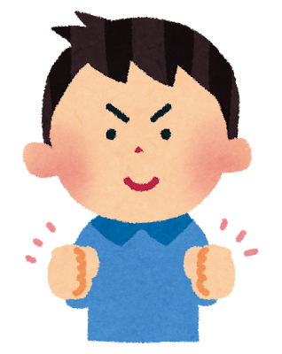

# スルスル消化できる
 タスク設定の方法

## 今日のメッセージ

- 手がつかないのは **意志が弱いから** ではない
- 脳が「このタスクは重い」と判断した瞬間、起動にブレーキがかかる
- 逆に「これなら軽い」と思えば **勝手に動き出す**
- ポイントは3つだけ: **小さくする、具体的にする、入口の摩擦をゼロにする**

## なぜ「やりたいのに動けない」のか

- 脳はタスクに取りかかる前に **認知的な「重さ」を無意識に見積もる**
- 曖昧で大きいタスクほど重く見積もられる
- 前頭前皮質が「今じゃなくていい」と判断 → これが **先延ばしの正体**
- 先延ばしの最大の予測因子は **タスクの嫌悪感**（Steel, 2007）
- 嫌悪感の大部分は「何をすればいいかわからない曖昧さ」

## 6つの実践テクニック

### 1. 極小にする
BJ Fogg「馬鹿みたいに小さくする」

### 2. 次の物理動作を書く
GTD「動詞＋対象＋道具」

### 3. 2分ルール
2分以内ならその場でやる

### 4. if-thenプランニング
「○○したら△△する」

### 5. 入口の摩擦をゼロに
判断コストを消す

### 6. 完了基準を下げる
「これでOK」のラインを下げる

## 1. 極小にする（Tiny Habits）

- BJ Fogg（スタンフォード大）の研究
- 新しい行動を始めるとき **「馬鹿みたいに小さくする」** のが最も確実
- **ゴールは「始めること」であって「完了すること」ではない**
- 脳は「始めてしまえば続ける」性質がある（**作業興奮**）

<!-- 2 -->

### ×「SNSを毎日投稿する」
重い。やる前から億劫になる

### ○「投稿画面を出す」
これだけでいい。たいてい「せっかくだから」と書き始める

## 2. 次の物理的動作を書く

- David Allen（GTD）の原則
- タスクリストに「SNS運用」と書いても脳は動けない
- **次にやる物理的な動作** を書く
- **「動詞＋対象＋場所or道具」** の形にする
- 「考える」「検討する」「進める」は動作ではない → **禁止**

<!-- 2 -->

### × 曖昧なタスク
「SNS投稿を考える」→ 脳が起動しない

### ○ 具体的な動作
「Threadsアプリを開いて、昨日の体験を1文で書く」

---

## 3. 2分ルール

- 2分以内にできるなら、リストに入れず **その場でやる**
- 判断・記憶のコスト > 実行コスト、というタスクは山ほどある
- 大きなタスクにも応用: **「最初の2分だけやる」** と決める
- 2分やって乗らなければ本当にやめていい
- たいていは続く

## 4. if-thenプランニング

- Gollwitzer（1999）で効果が繰り返し確認された手法
- **「いつ・どこで・何をするか」を事前に決めておく**
- その状況が来たとき脳が **自動的に行動を発火させる**
- 意志力に頼らず行動を自動化できる（Wendy Woodの習慣研究）

<!-- 2 -->

### 例1
「朝コーヒーを入れたら、Threadsを開いて1投稿書く」

### 例2
「昼休みにスマホを触ったら、最初にThreadsの下書きを確認する」

---

## 5. 入口の摩擦を物理的にゼロにする

- **「やるかどうか」の判断コストが最大の摩擦**
- 判断そのものを消す

<!-- 2x2 -->

### ホーム画面に配置
一番目立つ場所にアプリを置く

### 下書きをストック
「何を書こう」の判断が消える

### テンプレを用意
穴埋めするだけにする

### やめたい行動は逆に摩擦を増やす
アプリをフォルダの奥に入れる、ログアウトしておく

---

## 6. 完了の定義を下げる

- 完璧主義は先延ばしの燃料
- **「これでOK」のラインを意図的に下げる**
- SNS投稿は特にこれが効く → 質より **打席数**
- 100投稿して3つ当たればいい世界

<!-- 2 -->

### × 基準が高すぎる
「バズる投稿を書く」→ 着手できない

### ○ 低い完了基準
「誰にも刺さらなくていいから1つ出す」

## セルフチェック 5つの自問

タスクが億劫で動けないとき、この順番で確認する:

1. **小さいか？** → 「馬鹿みたいに小さく」できないか
2. **具体的か？** → 次の物理的動作は何か（動詞＋対象＋道具）
3. **入口は軽いか？** → 開くだけ・見るだけの状態にできないか
4. **トリガーはあるか？** → 「○○したら△△する」を決めたか
5. **完了基準は低いか？** → 「これでOK」のラインを下げられないか

## SNS投稿への適用例

<!-- 2 -->

### Before
- 「Threadsでフォロワーを増やすために毎日良い投稿をする」
- 曖昧、重い、基準が高い
- → 億劫 → やらない

### After
- **極小化:** 「投稿画面を開く」だけをタスクに
- **if-then:** 「朝コーヒーを淹れたら、Threadsを開く」
- **摩擦ゼロ:** ホーム画面にThreads、下書き3つストック
- **完了基準:** 「1文でも出せば今日は勝ち」
- **次の動作:** 「下書きの一番上を開いて投稿ボタンを押す」

## それでも動けないとき

- タスク設計を変えても動けない場合
- **スキーマ（無意識の信念）が邪魔** している可能性
- 体感（胸のざわつき、恥ずかしさ、逃げたい感じ）が伴うなら
- → タスク設計ではなくスキーマの問題
- → 「無意識の常識を最短で書き換える方法」のステップ1へ

## まとめ

- 動けないのは意志の問題ではなく **タスクの見せ方の問題**
- 脳の見積もりを変えれば自然に動ける
- **小さく、具体的に、摩擦ゼロ**
- 今日から1つだけ試してみよう

